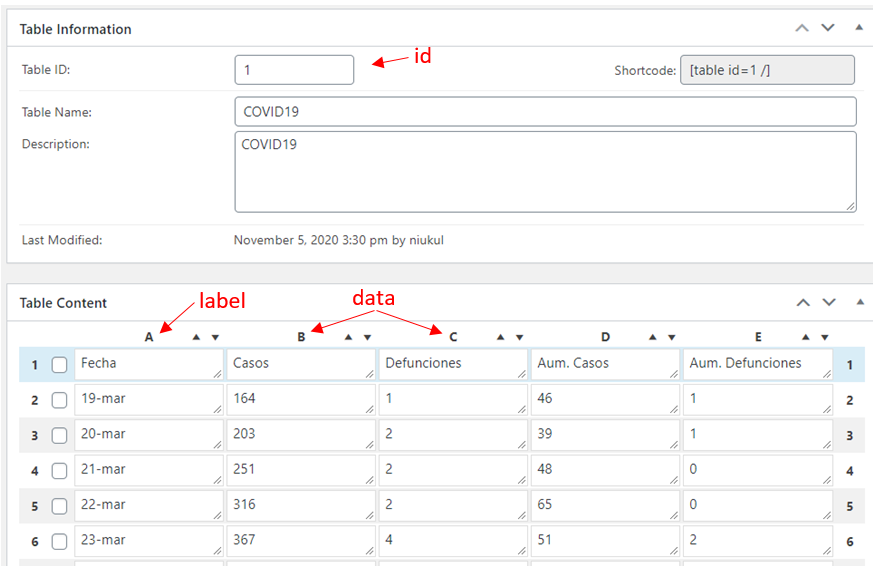
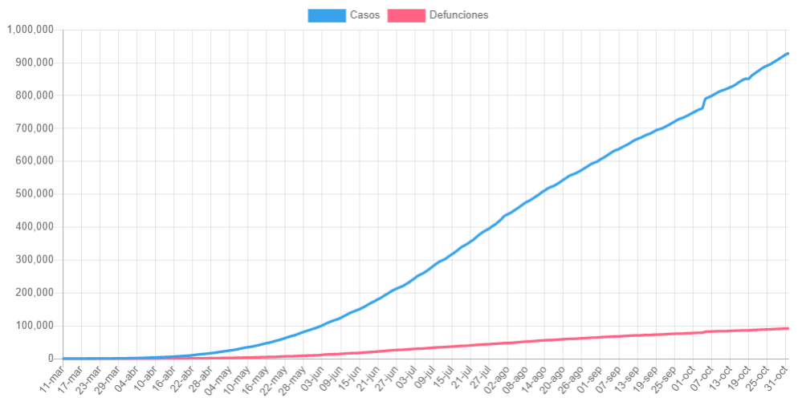

# TablePress Extension: Chart.js

Create a [Chart.js](https://www.chartjs.org/) using [TablePress](https://tablepress.org/) as data source for [WordPress](https://wordpress.org/download/)

## Index

- [About](#About)
- [Usage](#Usage)
- [Install](#Install)
- [Attributes](#Attributes)
    - [`id`](#att_id)
    - [`label`](#att_label)
    - [`data`](#att_data)
    - [`chart`](#att_chart)
    - [`color`](#att_color)
    - [`height`](#att_height)
    - [`first`](#att_first)
    - [`last`](#att_last)
- [Donate to Developer](#Donate)
- [ToDo](#ToDo)
- [Changelog](#Changelog)
    - [Unreleased](#Unreleased)
    - [0.2](#v02)
    - [0.1](#v01)
- [Credits](#Credits)

## About

This plugin code base and idea is a modification of [TablePress Extension: Chartist](https://github.com/soderlind/tablepress_chartist).

## Usage

Use the Shortcode `tp-chartjs`

    [tp-chartjs id=1 label=A data=B,C/]

To create a chart from the TablePress ID `1` where labes are column `A`, and dataset points are columns `B` and `C`.

Result:

## Install

Prerequisite: The [TablePress](https://tablepress.org/) plugin

## Attributes

#### `id`

TablePress ID reference

* **Example:** `[tp-chartjs id=1/]`
* **Value:** Integer `id`
* **Required**

#### `label`

Column Axis label

* **Example:** `[tp-chartjs id=1 label=A data=B,C/]`
* **Value:** One character from TablePress columns [A-Z]
* **Default:** `A`

#### `data`

Column(s) datasets used to populate chart

* **Example:** `[tp-chartjs id=1 label=A data=B,C,D,E/]`
* **Values:** One or more comma separated columns character [A-Z]
* **Default:** `B`

#### `chart`

Chart type used

* **Example:** `[tp-chartjs id=1 label=A data=B,C chart=line/]`
* **Values:** Select one of this
    * `line`: Line
    * `hbar`: Vertical Bar
* **Default:** `line`

#### `color`

The colors you can use in populated lines or bars.

* **Example:** `[tp-chartjs id=1 label=A data=B,C color=blue,red/]`
* **Values:** One or more comma separated colors
    * `blue`
    * `red`
    * `orange`
    * `yellow`
    * `green`
    * `purple`
    * `grey`
    * `black`
* **Default:** `blue,red,orange,yellow,green,purple,grey,black`

On example column `B` draws `blue` and column `C` draws `red`

#### `height`

Declare height of `canvas` HTML object

* **Example:** `[tp-chartjs id=1 label=A data=B,C height=300/]`
* **Values:** Integer value transformed into pixels
* **Default:** Automatic

#### `first`

Declare that only use the first `{n}` rows of data

* **Example:** `[tp-chartjs id=1 label=A data=B,C first=10/]`
* **Value:** Integer value offset
* **Default:** All data

#### `last`

Declare that only use the last `{n}` rows of data

* **Example:** `[tp-chartjs id=1 label=A data=B,C last=10/]`
* **Values:** Integer value offset
* **Default:** All data

## Donate to Developer

If you like my work, please donate to help me.

## ToDo

- [ ] Chart Title
- [ ] Vertical Bar chart support
- [ ] Pie chart support
- [ ] Time Series chart support
- [ ] Stacked chart support

## Changelog

All notable changes to this project will be documented in this file.

The format is based on [Keep a Changelog](https://keepachangelog.com/en/1.0.0/),
and this project adheres to [Semantic Versioning](https://semver.org/spec/v2.0.0.html).

### [Unreleased]

### [0.2] - 2020-11-06

#### Added
- New attribute `height` for the canvas object
- New attribute `color={color1,color2,..n}` comma separator
- Supported colors [blue,red,orange,yellow,green,purple,grey,black]
- New attribute `first={n}` show only `{n}` first rows
- New attribute `last={n}` show only `{n}` last rows

#### Changed
- Attribute `data` now accept A-Z to correspond TablePress columns
- Attribute `dimension` to `label` attribute
- `_maybe_string_to_number` RegExp

### [0.1] - 2020-11-01
- Initial release

[Unreleased]: https://github.com/developarts/tablepress_chartjs/tree/main
[0.2]: https://github.com/developarts/tablepress_chartjs/commit/c8701c23997335aa0fc04c4509818ea25bb88d48
[0.1]: https://github.com/developarts/tablepress_chartjs/commit/0ae2f6e3f8bfa2c9982f9b4bdde2a1fb97fa7b67

## Credits

* Muriz Serifovic for creating [TablePress Extension: Chartist](https://github.com/soderlind/tablepress_chartist).
* Tobias Bäthge for creating [TablePress](https://tablepress.org/)
* Alejandro García [DevelopArts](https://github.com/developarts)
